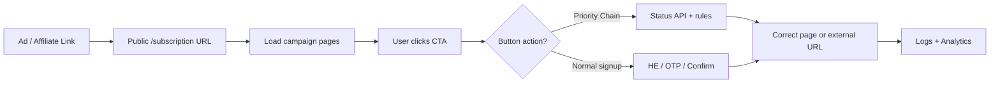

# WAP Manager (HTML Canvas) — Client Guide

**What this platform is:** a single visual system to design mobile subscription landing pages, connect partner billing APIs, route users by phone / OTP / header enrichment, and run **Priority Chain** checks (status → page) — without deploying a new app for every campaign.

Use this document when explaining the product to clients, ops, or partners.

---

## 1. What can you do with this project?

| Capability | What the user / admin gets |
| :--- | :--- |
| **Campaigns** | Create unlimited campaigns by **Country + Operator + Service ID** on one engine |
| **Visual page designer** | Design landing & funnel pages in a drag-and-drop canvas (GrapesJS) — HTML/CSS without coding |
| **Button / hotspot actions** | Point any button or invisible hotspot to: signup flow, another page, external URL, scroll, or **Priority Chain** |
| **Verification modes** | Header Enrichment (1-click), OTP-only, hybrid (BOTH), or direct CG redirect |
| **Partner APIs** | Configure blocklist, already-subscribed check, charge/subscribe, MSISDN resolve, custom headers |
| **Priority Chain** | On click: call partner status URL → match response fields → go to the right page (or website) |
| **Live subscriber link** | Share one public URL; engine loads the right campaign + pages dynamically |
| **Analytics & logs** | Visits, conversions, OTP stats, API call logs, and per-session journey timeline |

**End consumer experience:** open the campaign link → see branded pages → verify phone (header or OTP) → confirm pack → thank-you / blocked / error / custom pages as configured.

**Admin experience:** create campaign → design pages → wire buttons → set APIs / Priority rules → publish → monitor logs & analytics.

---

## 2. How a campaign works (simple flow)



**Typical public link shape:**

```text
/subscription?country=<Country>&operator=<Operator>&campid=<CampaignId>
```

Optional test params (e.g. `msisdn=`) can be added for QA.

---

## 3. Campaign setup (admin)

### 3.1 Create a campaign

1. Open **Campaigns** in the admin panel.
2. Click **Create Campaign**.
3. Fill:
   - **Name** — e.g. *Jio Games India*
   - **Country** / **Operator** — routing & audit isolation
   - **Service ID** — partner / carrier billing id
   - **Verification mode** — see section 4

### 3.2 Design pages (canvas)

Each campaign can include these page types:

| Page | Purpose |
| :--- | :--- |
| **HOME** | Main offer / CTA landing |
| **OTP** | Enter mobile + OTP when header is missing |
| **CONFIRM** | Pack choice & final confirm |
| **THANKYOU** | Success / already subscribed |
| **BLOCKED** | DND / not eligible |
| **ERROR** | Technical / config failure |
| **LOW_BALANCE** | Optional — e.g. parking / insufficient balance |
| **INPROGRESS** | Optional — pending / in-progress status |

Required for a full funnel: **HOME, OTP, CONFIRM, THANKYOU**. Extra pages are used heavily with **Priority Chain** rules.

### 3.3 Partner API configuration

Per campaign (API Configuration):

| API | Role |
| :--- | :--- |
| **Blocklist** | Skip billing if number is barred |
| **Subscription check** | Detect already active → thank-you / skip recharge |
| **Subscribe / charge** | Trigger partner billing |
| **MSISDN resolve** | Lookup number when not in header |
| **Headers JSON** | Auth tokens for partner calls |

**URL placeholders** (filled automatically at runtime):

- `{{phone}}` / `{{msisdn}}`
- `{{serviceId}}`, `{{country}}`, `{{operator}}`
- `{{planId}}` / `{{pack}}`, `{{subServiceId}}`

---

## 4. Verification modes

| Mode | Behavior | Best for |
| :--- | :--- | :--- |
| **HEADER_INJECTION** | Read MSISDN from network header → confirm / thank-you; missing → error | Pure WAP / carrier data |
| **OTP_ONLY** | Always ask phone + OTP | Wi‑Fi / web traffic |
| **BOTH** (recommended) | Try header first; if missing → OTP | Mixed cellular + Wi‑Fi |
| **NONE** | Append click params and redirect to external CG URL | Affiliate / external gateway only |

---

## 5. Button & hotspot actions (editor)

Select any **button** or **hotspot** in the canvas. In the property panel, **When clicked**:

| Option | What happens |
| :--- | :--- |
| **Continue signup flow** | Normal HE / OTP / confirm path (`SUBSCRIBE`) |
| **Scroll to a section** | Same-page smooth scroll |
| **Go to another page** | Jump to OTP, CONFIRM, THANKYOU, etc. |
| **Open a website** | External redirect |
| **Try checks in order** | **Priority Chain** (see next section) |

No manual HTML coding is required — the editor writes the attributes for you.

---

## 6. Priority Chain — full client guide

### 6.1 What is Priority Chain?

**Priority Chain** (“Try checks in order”) lets one button run **ordered steps**. Typical use:

1. Call a partner **status / check-subscription** URL.
2. Read fields from the JSON response (e.g. `currentStatus = active`).
3. Send the user to the matching **campaign page** or an **external website**.
4. If nothing matches, either try the next step, open a fallback page, or open a website.

**Why clients use it**

- Already subscribed → Thank you (no double charge)
- Low balance / parking → Low balance page
- Pending → In progress page
- New user → Confirm / OTP to continue signup
- Custom eligibility, fraud, or CRM checks before billing

Steps run **top → bottom**. **First matching rule wins**; later steps are skipped once a page/redirect happens.

### 6.2 How to configure (editor steps)

1. Open the campaign in the **Canvas editor**.
2. Select the CTA button (or draw a hotspot).
3. **When clicked** → choose **Try checks in order**.
4. Open the Priority Chain modal (**Try checks in order**).
5. Add / reorder steps (↑ ↓). Save is applied on the button as you edit.

### 6.3 Step types

| Step type | Meaning |
| :--- | :--- |
| **Check a status URL** | HTTP call to partner API; evaluate **rules** |
| **Go to another page** | Navigate to a campaign page |
| **Open a website** | Full browser redirect |
| **Scroll to a section** | Same-page scroll |
| **Continue signup flow** | Hand off to normal verification flow |

### 6.4 Status URL + rules (most important part)

For a **Check a status URL** step:

1. Paste the partner URL, e.g.  
   `https://partner.example.com/sub/checksub?msisdn={{msisdn}}&serviceId=WELLNESS`
2. Under **Where to go for each status**, add rules:

| Response field | Equals | Then go to |
| :--- | :--- | :--- |
| `currentStatus` | `active` | Thank you page |
| `currentStatus` | `parking` | Low balance page |
| `currentStatus` | `pending` | In progress page |
| `currentStatus` | `new` | Confirm page |

- Field names can be top-level or nested under `data` (e.g. `data.currentStatus` / `subscriptionStatus`).
- Snake_case / camelCase variants are handled where possible.
- Destination can be a **campaign page** or a **website URL**.

**If nothing matches**

- Try the next step, **or**
- Go to a page (e.g. Confirm / Error), **or**
- Open a website

**If the check fails to load** (network / HTTP error)

- Same choices: continue, page, or website (often **Error**).

### 6.5 Example chain (client-ready)

**Button on HOME:** Subscribe

| Priority | Type | Config |
| :--- | :--- | :--- |
| **1** | Status URL | `.../checksub?msisdn={{msisdn}}&serviceId=...` with rules above |
| **2** | Go to page | **OTP** (only reached if Priority 1 continues / no phone yet) |

**Runtime behavior**

- Phone known + `active` → **THANKYOU** (stop).
- Phone known + `parking` → **LOW_BALANCE** (stop).
- Phone known + `new` / no match → next step or configured miss page (e.g. **CONFIRM**).
- Phone **not** available yet and URL needs `{{msisdn}}` → that API step is **skipped**; chain continues (e.g. to OTP).
- Absolute `https://` partner URLs are called via the **platform proxy** (avoids browser CORS); each call can be logged as a **priority** API call for audit.

### 6.6 Priority Chain — FAQ

**Q: Do I need a developer to change status → page mapping?**  
No. Change rules in the editor modal.

**Q: Can one status go to an external offer URL?**  
Yes — set rule destination to **A website**.

**Q: What if the partner returns an unexpected status?**  
Use **If nothing matches** (continue / page / website).

**Q: Will later priorities still run after a match?**  
No. First match navigates and stops the chain.

**Q: Where do I see what happened for a user?**  
Session / API logs show **priority** checks (URL, status, which priority step).

---

## 7. Public runtime (what the end user sees)

- Campaign HTML/CSS is rendered in an isolated **Shadow DOM** so template styles do not clash with the app shell.
- Clicks on buttons/hotspots are intercepted — no full page reload for in-campaign navigation.
- URL updates with `step=` (e.g. `CONFIRM`, `THANKYOU`) so the current funnel step is clear and shareable for debugging.

---

## 8. Analytics, logs & timelines

| Area | What you get |
| :--- | :--- |
| **Campaign analytics** | Visits, plan views, subscribe success/fail, blocked, etc. |
| **OTP analytics** | Delivery / resend / provider performance |
| **Event & API logs** | Filter by visit id, MSISDN, click id, vendor / affiliate |
| **Session timeline** | Ordered journey: visit → HE → blocklist → priority API → subscribe outcome |

---

## 9. Client Q&A

**Can numbers be international (UAE, KSA, etc.)?**  
Yes. Non-digits are stripped; no hard-coded 10-digit-only rule. Partner APIs receive the sanitized number.

**Wi‑Fi user, no header?**  
In **BOTH** mode the user is sent to **OTP** automatically.

**Do we write `data-action` by hand?**  
No — use the property panel dropdowns / Priority modal.

**Already subscribed — double charge?**  
Subscription check (campaign API and/or Priority status rules) can route to **THANKYOU** / `ALREADY_SUBSCRIBED` and skip charging.

**One codebase for many operators?**  
Yes. One multi-tenant engine; each campaign is data + canvas pages + API config.

---

## 10. Go-live checklist

- [ ] Create campaign (country, operator, service id, verification mode — prefer **BOTH**)
- [ ] Configure partner APIs (blocklist, check-sub, subscribe, headers)
- [ ] Design HOME / OTP / CONFIRM / THANKYOU (+ LOW_BALANCE / INPROGRESS if needed)
- [ ] Wire CTA: normal flow **or** Priority Chain with status rules
- [ ] Test public link with cellular + Wi‑Fi (and with/without `msisdn` where allowed)
- [ ] Confirm Priority API rows appear in logs when the CTA is clicked
- [ ] Review analytics after a small live sample

---

## 11. One-line summary for the client

**HTML Canvas (WAP Manager)** lets you design branded subscription funnels once, attach operator APIs, and use **Priority Chain** so a single button can check partner status and send each user to the right page — all without shipping a new website per campaign.
