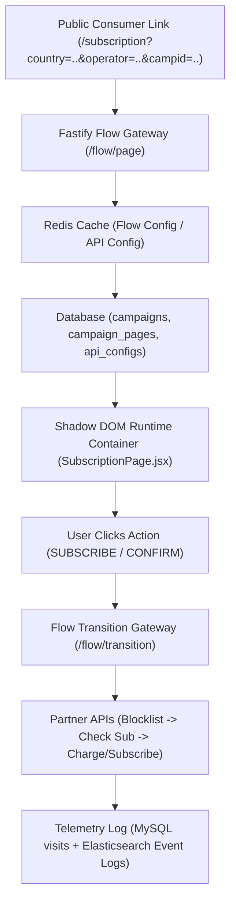

# WAP Manager & Dynamic Funnel Engine: End-to-End Client & Technical Manual

> [!IMPORTANT]
> This document serves as an exhaustive, step-by-step master reference for creating, configuring, customizing, executing, and auditing campaigns on the unified **WAP Manager (html-canvas)** platform. It details every architectural decision, backend mechanism, frontend editor binding, and logging system so you can confidently present and defend the platform to any client or team member.

---

## 1. Core Architecture & Philosophy: Why a Single Engine?

### The Old Model (Fragmented Setup)
In legacy setups (such as [safwap-server-backup](file:///Users/abhinavvishwakarma/work/JPL/wapManager/html-canvas/safwap-server-backup)), every new campaign or telecom operator required:
- Deploying a separate application codebase or hosting static HTML files.
- Hardcoding operator callback URLs (`DigitalTraffic.sp_CPACallBack`) directly in backend code.
- Fragmented logging in flat `.log` files on disk.

### The New Unified Model (`html-canvas`)
The modern platform uses a **Single Universal Multi-Tenant Runtime Engine**:
- **Zero-Code Deployment**: Unlimited campaigns run on one central engine ([SubscriptionPage.jsx](file:///Users/abhinavvishwakarma/work/JPL/wapManager/html-canvas/frontend/src/pages/SubscriptionPage.jsx) + [flow.service.js](file:///Users/abhinavvishwakarma/work/JPL/wapManager/html-canvas/backend/src/modules/flow/flow.service.js)).
- **Dynamic Routing**: When a subscriber opens a link like `/subscription?country=India&operator=Jio&campid=101`, the system dynamically resolves the campaign, loads its custom GrapesJS HTML/CSS pages, fires configured partner APIs, and tracks analytics.



---

## 2. Step 1: Campaign Creation & Provisioning

### 2.1 Creating a Campaign
1. Navigate to **Campaigns Dashboard** (`/campaigns`) in the Admin Panel.
2. Click **Create Campaign**.
3. Fill in the primary metadata:
   - **Name**: Campaign title (e.g. *Jio Games India*).
   - **Country**: Target country (e.g. *India*, *UAE*, *Saudi Arabia*).
   - **Operator**: Target telecom operator (e.g. *Jio*, *Etisalat*, *STC*).
   - **Service ID**: Billing identifier assigned by the carrier/partner.
   - **Verification Mode**: Choose from 4 engine modes (`HEADER_INJECTION`, `OTP_ONLY`, `BOTH`, `NONE`).

> [!NOTE]
> **Reason for Operator/Country Binding**: Telecom charging gateways require specific headers and endpoints tailored per operator/market. Binding `country` and `operator` guarantees clean URL routing and audit isolation.

---

## 3. Step 2: Understanding Verification Modes & Flow Graph

The engine's decision tree is powered by [flow-engine.service.js](file:///Users/abhinavvishwakarma/work/JPL/wapManager/html-canvas/backend/src/modules/flow/flow-engine.service.js#L3-L45):

| Verification Mode | Behavior & Entry Sequence | Primary Use Case |
| :--- | :--- | :--- |
| **`HEADER_INJECTION`** | Checks header for MSISDN (`X-MSISDN`). If found $\rightarrow$ proceeds directly to `CONFIRM` or `THANKYOU`. If missing $\rightarrow$ routes to `ERROR` page. | Direct 1-Click WAP / Mobile Data traffic where telco injects numbers. |
| **`OTP_ONLY`** | Skips auto header checks $\rightarrow$ requires user to enter phone number $\rightarrow$ sends SMS OTP $\rightarrow$ verifies code $\rightarrow$ proceeds to `CONFIRM`. | Wi-Fi traffic, Web traffic, or markets without Header Enrichment gateways. |
| **`BOTH` (Recommended)** | Hybrid: Tries Header Enrichment first. If MSISDN resolved $\rightarrow$ skips to `CONFIRM`. If MSISDN missing $\rightarrow$ gracefully falls back to `OTP` page. | Universal campaigns handling both 4G/5G Cellular Data and Wi-Fi users seamlessly. |
| **`NONE` (Direct Redirect)** | Direct 1-Click Null-Flow: Immediately appends `click_id` / attribution parameters and redirects to an external CG URL (`cgRedirectUrl`). | Pure affiliate routing or external carrier landing gateways. |

---

## 4. Step 3: Partner API Configuration (`api_configs`)

Configured per campaign in the **API Configuration Tab** ([backend/src/modules/api-config/entities/api-config.entity.js](file:///Users/abhinavvishwakarma/work/JPL/wapManager/html-canvas/backend/src/modules/api-config/entities/api-config.entity.js#L19-L61)):

### 4.1 Endpoints Setup
1. **Blocklist Check API (`blocklistApi`)**: Checks if phone number is DND/Blacklisted before billing.
2. **Active Subscription API (`subscriptionApi`)**: Checks if user is already an active subscriber. If active, prevents re-charging and routes directly to `THANKYOU` page with status `ALREADY_SUBSCRIBED`.
3. **Charge / Subscribe API (`subscribeApi`)**: Triggers actual billing setup on partner gateway.
4. **Header Enrichment Lookup (`resolveMsisdnUrl`)**: External MSISDN lookup endpoint for non-header network gateways.
5. **Headers JSON (`headersJson`)**: Custom authentication headers (e.g. `{"Authorization": "Bearer TOKEN"}`) passed to partner endpoints.

### 4.2 Dynamic URL Template Placeholders
You can use standard variable placeholders in partner URLs. The engine ([partner-api.service.js:L28-L40](file:///Users/abhinavvishwakarma/work/JPL/wapManager/html-canvas/backend/src/modules/flow/partner-api.service.js#L28-L40)) automatically interpolates them:

- `{{phone}}` or `{{msisdn}}` $\rightarrow$ Subscriber mobile number.
- `{{serviceId}}` $\rightarrow$ Campaign service identifier.
- `{{country}}` / `{{operator}}` $\rightarrow$ Country and carrier names.
- `{{planId}}` / `{{pack}}` $\rightarrow$ Selected plan (`daily`, `weekly`, `monthly`).
- `{{subServiceId}}` $\rightarrow$ Auto-mapped pack code (`HDaily`, `HWeekly`, `HMonthly`).

---

## 5. Step 4: Visual Page Builder (GrapesJS Canvas)

### 5.1 The 6 Standard Campaign Pages
Each campaign consists of standard pages managed in the Canvas Editor ([TemplateEditor.tsx](file:///Users/abhinavvishwakarma/work/JPL/wapManager/html-canvas/frontend/src/editor/TemplateEditor.tsx)):

1. **`HOME` (Landing Page)**: Main promotional offer, hero image, subscription trigger button.
2. **`OTP` (Verification Page)**: Phone input, OTP code input, "Get OTP" & "Verify & Continue" buttons.
3. **`CONFIRM` (Billing Confirmation Page)**: Pack picker (Daily/Weekly/Monthly) and final confirm button.
4. **`THANKYOU` (Success Page)**: Confirmation message, content access link.
5. **`BLOCKED` (Restricted User Page)**: Displayed when partner API returns DND/Blocked status.
6. **`ERROR` (Fallback Page)**: Displayed when technical errors or invalid parameters occur.

---

## 6. Step 5: Buttons, Hotspots & Priority Flow Chains

### 6.1 Visual Button & Hotspot Setup (No Manual Coding Needed!)
When the client selects any button or draws a transparent hotspot overlay in the GrapesJS editor, the right-hand **Property Panel** ([PropertyPanel.jsx:L1088-L1138](file:///Users/abhinavvishwakarma/work/JPL/wapManager/html-canvas/frontend/src/editor/shell/PropertyPanel.jsx#L1088-L1138)) provides visual options:

```html
<!-- Automatically generated by Editor UI dropdown selection -->
<button type="button" data-action="SUBSCRIBE" class="flow-btn">Subscribe Now</button>
<button type="button" data-action="CONFIRM" class="flow-btn">Confirm Payment</button>
```

#### Action Dropdown Choices in Editor:
- **"Continue verification flow (HE / OTP)"** $\rightarrow$ Binds `data-action="SUBSCRIBE"`.
- **"Another page in this campaign"** $\rightarrow$ Direct page link (`OTP`, `CONFIRM`, etc.).
- **"Another website (URL)"** $\rightarrow$ External URL redirect.
- **"Another part of this page (Scroll)"** $\rightarrow$ Smooth scroll to section (`#anchor`).
- **"Sequential Action Chain (Priority Flow)"** $\rightarrow$ Advanced multi-step priority chain.

---

### 6.2 Advanced Feature: Priority Action Chains (`data-action="CHAIN"`)
For complex campaigns requiring preliminary API checks before advancing, the client can configure **Sequential Priority Chains** directly in the editor ([PropertyPanel.jsx:L453-L479](file:///Users/abhinavvishwakarma/work/JPL/wapManager/html-canvas/frontend/src/editor/shell/PropertyPanel.jsx#L453-L479)):

1. **Priority 1 (Webhook / API Check)**: Hits a custom validation URL (e.g. `https://client-partner.com/api/eligibility-check`).
2. **Priority 2 (Page Transition)**: If Priority 1 succeeds, proceeds to `CONFIRM` or `OTP` page.

> [!TIP]
> **Why Priority Chains?** Allows clients to run custom fraud checks, balance checks, or external CRM logging before allowing the user to enter the billing stage.

---

## 7. Step 6: Public Consumer Runtime & Shadow DOM Isolation

### 7.1 Why Shadow DOM? ([SubscriptionPage.jsx:L89-L94](file:///Users/abhinavvishwakarma/work/JPL/wapManager/html-canvas/frontend/src/pages/SubscriptionPage.jsx#L89-L94))
Public subscriber templates are mounted inside a **Shadow DOM Container** (`attachShadow({ mode: 'open' })`):

* **Reason 1 (Style Isolation)**: Prevents global application styles from breaking custom client HTML/CSS templates, and vice versa.
* **Reason 2 (Click Interception)**: Uses `composedPath()` event traversal to intercept click events on buttons/hotspots without requiring full page reloads.
* **Reason 3 (Client-Side Navigation)**: Router navigation updates query parameters (`step=CONFIRM`) in the browser URL for instantaneous page rendering.

---

## 8. Step 7: Telemetry Analytics, Logs & Session Timelines

### 8.1 Campaign Analytics Dashboard ([analytics.service.js](file:///Users/abhinavvishwakarma/work/JPL/wapManager/html-canvas/backend/src/modules/analytics/analytics.service.js))
Tracks metrics per campaign:
- **Total Impressions & Unique Visits**.
- **Conversion Metrics**: `VISIT`, `BLOCKED`, `PLAN_VIEW`, `CONFIRM_VIEW`, `SUBSCRIBE_CLICK`, `SUBSCRIBE_SUCCESS`, `SUBSCRIBE_FAILED`.
- **OTP Analytics Dashboard**: Hourly/Daily OTP delivery rates, resend attempt rates, and provider performance comparison.

### 8.2 Campaign Event Logs & Elasticsearch ([search.service.js](file:///Users/abhinavvishwakarma/work/JPL/wapManager/html-canvas/backend/src/modules/search/search.service.js))
Searchable real-time logs page (`/logs`) allows filtering by:
- `Visit ID`, `MSISDN`, `Click ID`, `Vendor ID`, `Affiliate ID`.

### 8.3 Session Timeline Modal ([SessionTimelineModal.jsx](file:///Users/abhinavvishwakarma/work/JPL/wapManager/html-canvas/frontend/src/components/dashboard/SessionTimelineModal.jsx))
Clicking on any Visit ID opens a visual **User Journey Timeline**:
1. `VISIT` $\rightarrow$ User landed on HOME page (Timestamp, IP, User-Agent).
2. `HE_RESOLVE` $\rightarrow$ Header Enrichment MSISDN detected.
3. `BLOCKLIST_CHECK` $\rightarrow$ Passed DND filter.
4. `SUBSCRIBE_SUCCESS` $\rightarrow$ Billed successfully on partner gateway.

---

## 9. Frequently Asked Questions (Client Q&A Cheat Sheet)

#### Q1: "Can phone numbers come in any international format?"
> **Answer**: Yes. The system imposes no hardcoded 10-digit or country-specific regex restrictions. Numbers from any country (UAE `971...`, KSA `966...`, Europe, Africa) are sanitized of non-numeric characters and passed directly to partner billing APIs.

#### Q2: "What if Header Enrichment fails when a user is on Wi-Fi?"
> **Answer**: Under `BOTH` mode, if Header Enrichment fails or returns empty, the engine automatically falls back to the `OTP` page so the user can enter their mobile number manually.

#### Q3: "Does the client need to write HTML attributes manually for buttons?"
> **Answer**: No. In the GrapesJS visual editor, selecting any button or hotspot opens the Property Panel dropdown where the client selects the desired action visually.

#### Q4: "How does the system prevent double-charging an already subscribed user?"
> **Answer**: At the `CONFIRM` transition step, `partnerApiService.checkSubscription()` is invoked. If the partner API returns `active`, the engine skips billing and routes the user to `THANKYOU` with status `ALREADY_SUBSCRIBED`.

---

## 10. Summary Checklist for Creating a New Campaign

- [x] **Create Campaign**: Set Name, Country, Operator, Service ID, and Verification Mode (`BOTH`).
- [x] **Configure Partner APIs**: Fill in `blocklistApi`, `subscriptionApi`, `subscribeApi`, and `headersJson` in API Configuration Tab.
- [x] **Design Pages in Canvas**: Customize `HOME`, `OTP`, `CONFIRM`, `THANKYOU` templates in GrapesJS Editor.
- [x] **Verify Button Actions**: Ensure buttons are linked to `SUBSCRIBE` / `CONFIRM` via Property Panel dropdown.
- [x] **Test Flow Link**: Test entry link `http://localhost:5173/subscription?country=<Country>&operator=<Operator>&campid=<ID>&msisdn=<TestNumber>`.
- [x] **Audit Telemetry**: Verify visit footprints and logs on `/logs` and `/analytics` dashboards.
