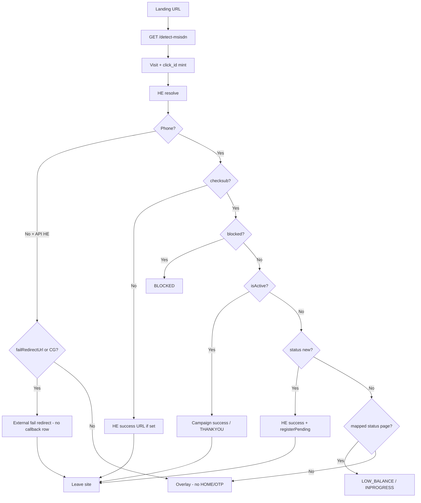

# WAP Manager — Subscription Flow Architecture (AI Reference)

> **Canonical reference** for the public subscription funnel, Header Enrichment (HE),
> partner APIs, attribution, redirects, and conversion postbacks.
>
> Give this file to an AI (with the code) when changing flow behaviour.
> If this doc and code disagree, **trust the code** and update this doc.

**Last updated:** Aug 2026  
**Related docs:**
- `docs/SAFARICOM_HE_SETUP_GUIDE.md` — operator-specific setup checklist
- `docs/HE-DETECT-FLOW-ARCHITECTURE.md` — short pointer (superseded by this file)

---

## 0. Mental model (read this first)

```
Affiliate / vendor tracking URL
        │
        ▼
 /subscription?...&tracking_campid=BF-OBF-11&campid={vendor}&click_id={network}
        │
        ▼
 SubscriptionPage (frontend)
   ├─ Detect  → GET /api/flow/detect-msisdn   (visit-first, HE, checksub, routing)
   └─ Boot    → GET /api/flow/page            (funnel HTML; waits for detect on API HE)
        │
        ▼
 Outcome:
   • External redirect (HE success / fail / campaign success / null-flow CG)
   • Internal status page (LOW_BALANCE, BLOCKED, INPROGRESS, THANKYOU, …)
   • Classic funnel (HOME → OTP/CONFIRM → subscribe) for non–API-HE modes
```

### 0.1 Three “what happens next?” systems (the kichdi)

These overlap in the UI and in people’s heads. They are **not** the same layer:

| # | System | Where configured | Used at runtime when… | Source of truth for |
|---|--------|------------------|------------------------|---------------------|
| **A. Detect routing** | Campaign HE + `api_configs` + checksub | Campaign API / HE modal | Landing: `/detect-msisdn` | Redirect out, status page, or “stay for funnel” |
| **B. Flow graph (mode)** | `verificationMode` + `flowConfig` (nodes/edges) | **Campaign Detail** mode picker (defaults graph); old `/flow` URL redirects here | Button has `data-action=SUBSCRIBE` (or CONFIRM/OTP continue) → `POST /transition` | Classic signup path: HOME→OTP/CONFIRM by mode + conditions |
| **C. Canvas button config** | Per-control “When clicked” | Canvas PropertyPanel | Click on that control | Direct page jump, external URL, scroll, or Priority Chain — **bypasses B** |

**Runtime rule of thumb:**

- Landing decision (leave site vs show HOME/status) → **A**
- CTA marked “Continue signup flow” (`SUBSCRIBE`) → **B** (`flow-engine` + `verificationMode`)
- CTA marked “Go to another page” / “Open a website” / “Try checks in order” → **C** only (frontend `useShadowInteractions` / `runPriorityChain`)

So the user’s instinct is half-right: **canvas buttons already define flow for many campaigns**. Mode + engine remain load-bearing for **verificationMode** and for the default SUBSCRIBE/CONFIRM condition graph — the drag-drop edge editor is **not** primary UX anymore (Campaign Detail shows mode + read-only path).

**KEEP / SIMPLIFY / REMOVE (Option A — implemented):**

| Piece | Verdict |
|-------|---------|
| Detect + HE + redirects | **KEEP** — core product |
| Canvas “When clicked” (page / URL / chain / SUBSCRIBE) | **KEEP** — primary authoring for page→next |
| `verificationMode` | **KEEP** — picker on Campaign Detail |
| `flowConfig` graph engine (`flow-engine.service.js`) | **KEEP** — mode→default graph; custom edges not first-class UX |
| Flow Builder drag-drop page | **HIDDEN** — `/flow` redirects to Campaign Detail; `FlowBuilderPage.jsx` retained but unused |
| Priority Chain | **KEEP** — canvas-owned advanced routing |

For **API HE** (`safaricom_masked`, `custom_http`, `custom`), HOME/OTP are suppressed until
an external redirect or an allowed status page is chosen — no funnel flash.

**Two layers must not be confused (within A→funnel):**

| Layer | Job |
|-------|-----|
| **Detect** | Resolve phone + decide redirect / status page (backend-heavy) |
| **Boot / funnel** | Load and transition campaign pages (HOME, OTP, CONFIRM, …) |

---

## 1. Key file map

| Area | Path |
|------|------|
| Public routes | `backend/src/modules/flow/flow.routes.js` |
| Detect, page, transition, CG URL builder | `backend/src/modules/flow/flow.service.js` |
| HE providers (token / masked / custom HTTP) | `backend/src/modules/flow/he.service.js` |
| checksub / blocklist / subscribe (partner HTTP) | `backend/src/modules/flow/partner-api.service.js` |
| Flow graph / verification modes | `backend/src/modules/flow/flow-engine.service.js` |
| `api_call_logs` | `backend/src/modules/flow/api-call-log.service.js` + `entities/api-call-log.entity.js` |
| Vendor CPA pending + fire | `backend/src/modules/partners/postback.service.js` |
| Dual campid split | `backend/src/modules/markets/tracking-id.util.js` |
| Page types + status→page map | `backend/src/modules/campaigns/entities/campaign-page.entity.js` |
| Subscription runtime UI | `frontend/src/pages/SubscriptionPage.jsx` |
| Phone resolve + HE redirect helper | `frontend/src/services/flow/resolvePhoneNumber.js` |
| Flow API client | `frontend/src/services/api/flow.js` |
| Campaign HE/API config UI | `frontend/src/components/dashboard/CampaignApiConfigModal.jsx` |
| Backend e2e smoke | `backend/scripts/e2e-detect-flow.mjs` |

---

## 2. Attribution model (do not collapse these)

### 2.1 Click IDs

| Field | Owner | Meaning |
|-------|-------|---------|
| `rcid` | Affiliate / network | Original click from the tracking URL |
| `click_id` / `clickId` | **Us** | UUID we mint per landing visit |

**First land rule** (`resolveAttributionParams` + `resolveOrCreateLandingVisit`):

1. Incoming `click_id` without an existing visit is treated as the affiliate seed → stored as `rcid`.
2. We mint a **new** internal `click_id` for the visit.
3. After that, URL/`detect` responses carry **our** `clickId`; `rcid` stays the network original.

### 2.2 Campaign IDs (dual campid)

| Field | Owner | Meaning |
|-------|-------|---------|
| `tracking_campid` | **Us** | Resolves the campaign (e.g. `BF-OBF-11`) |
| `campid` | Vendor / network | Fills vendor postback `{{campid}}` / `{{camp}}` |

Legacy: if only `campid` is present and it looks like our tracking id (composite `CC-OC-N` or numeric),
`splitDualCampids()` reclassifies it as `tracking_campid` and clears vendor `campid`.

### 2.3 Visit-first (invariant)

**One landing click → one visit**, created **before** any HE / checksub / blocklist HTTP.

- Dedupe identity: `(campaignId, rcid)` within a short window (~120s) + Redis lock.
- Race: if two visits slip through, reconcile to the oldest and abandon the orphan.
- Why: every `api_call_logs` row (HE token, MSISDN, checksub, `he_redirect`) must share the same `visitId` / `clickId` / `rcid`.

---

## 3. Hard privacy boundary (third parties)

**Never send our attribution to third-party redirects or partner APIs.**

| May leave our system | Must stay internal |
|----------------------|--------------------|
| Configured redirect URL as-is | `click_id` |
| Optional `{{msisdn}}` / `{{phone}}` in URL | `rcid` |
| `{{country}}` / `{{operator}}` on HE redirects | `campid` / `tracking_campid` |
| Partner body: phone, serviceId, plan, country, operator | `visitId` in partner body |

Implementation:

- HE success/fail: `detectMsisdn` fills only msisdn/phone/country/operator placeholders — **no** click/campid.
- `buildCgRedirectUrl`: does **not** auto-append `click_id` / `rcid` / `campid` (may still fill placeholders already in a configured CG/success URL; may append `msisdn` if known).
- Frontend `appendHeAttributionToUrl`: opens URL as configured; only fills `{{msisdn}}` / `{{phone}}` — **no** auto query append of click/campid.
- `partnerApiService.partnerRequestBody` / `buildVars`: strips click/campid/rcid/visit from outbound partner requests.

Vendor **CPA postbacks** (our → vendor after billing callback) **do** expand `{{click_id}}`, `{{rcid}}`, `{{campid}}` — that is intentional and separate from HE/partner redirect URLs.

---

## 4. Public API: `/api/flow`

Base path is typically `/api/flow` (see backend app registration).

### 4.1 `GET /detect-msisdn`

**Purpose:** Visit-first detect + routing decision for landing.

**Query (main):**
`country`, `operator`, `campid`, `tracking_campid`, `msisdn`/`phone`, `click_id`, `rcid`, `visitId`, `sessionId`, `vid`, `landingUrl`

**Headers:** carrier HE candidates (`x-msisdn`, `x-up-calling-line-id`, …) — see `extractHeaderMsisdn`.

**Response (main):**
```
phone, hasMsisdn, heProvider, heError,
failRedirectUrl, successRedirectUrl, cgRedirectUrl,
nextPage, blocked, blockReason, subscriptionStatus, isActive,
visitId, clickId, rcid
```

Also returns debug header fields in non-prod debugging paths.

### 4.2 `GET /entry`

Returns `{ campaignId, entryPage }` from flow graph / defaults.

### 4.3 `GET /page`

Renders a campaign page (`page=HOME|OTP|CONFIRM|…`).

**Guards:**
- Null-flow (`verificationMode=NONE` + `cgRedirectUrl`) may return `externalRedirect`.
- If detect already logged checksub for the visit, `/page` skips duplicate checksub.
- `direct=1` — editor/page-token bypass for rendering guards only (not a `/transition` security bypass).

### 4.4 `POST /transition`

Advances funnel: `fromPage` + `action` (`SUBSCRIBE`, `CONTINUE`, `CONFIRM`, …).

Rate-limited. May return next page payload or `externalRedirect` (null-flow CG).

### 4.5 `POST /priority-check`

Server-side proxy for Priority Chain partner GETs (avoids browser CORS). Logs `priority` into `api_call_logs`.

### 4.6 `GET|POST /callback`

Operator/billing → us. Finds pending `conversion_postbacks` by MSISDN and fires vendor CPA.

### 4.7 `POST /register-postback`

Optional pre-register of a pending conversion row (parity with CG / getredirecturl).

---

## 5. HE providers

Configured on `api_configs.he_provider` + `he_config_json`.

| `heProvider` | Behaviour | Phone source of truth |
|--------------|-----------|------------------------|
| `header` (default) | Trust carrier header / query / optional `HE_DUMMY_MSISDN` | Request hint |
| `none` | Never resolve | empty |
| `custom_http` / `custom` | GET/POST configured resolve URL | **API response only** |
| `safaricom_masked` | POST token → Bearer GET masked MSISDN | **API response only** |

**API HE** = `{ safaricom_masked, custom_http, custom }`.

Rules for API HE:

1. Always hit partner APIs (even if query/header/dummy phone exists) so Session Detail gets `he_token` / `he_msisdn` logs.
2. `rawPhone` for routing = provider response only — query/header/dummy **do not count**.
3. Frontend must not fall back to stale storage/URL phone on API HE fail.
4. Frontend suppresses HOME/OTP while unresolved / when redirecting.

### 5.1 Safaricom token contract (`safaricom_masked`)

```
POST tokenUrl
  headers: { X-Session-ID, Content-Type: application/json }
  body: {}  (or heConfig.tokenBody)
  → access_token

GET maskedUrl
  headers: {
    Authorization: Bearer <token>,
    X-App: he-partner,
    X-MessageID: 1234,
    X-Source-System: he-partner
  }
  → masked MSISDN in partner response shape
```

Optional overrides in `heConfigJson`: `tokenMethod`, `tokenHeaders`, `tokenBody`,
`maskedHeaders`, `xApp`, `xSourceSystem`, `messageId`, `sessionId`,
aliases `heTokenUrl` / `maskedMsisdnUrl`, redirect aliases `heFailRedirectUrl` / `heSuccessRedirectUrl`.

### 5.2 Request MSISDN priority (route layer — non–API-HE)

Used by `/detect-msisdn` and `/page` for the **hint** passed into services:

1. Real carrier header  
2. Query `msisdn` / `phone`  
3. `HE_DUMMY_MSISDN` env (only if no header/query)

API HE ignores this hint for the final phone decision.

---

## 6. `detectMsisdn` pipeline

```
0. Resolve campaign (country + operator + tracking_campid / legacy campid)
1. resolveOrCreateLandingVisit  → visitId, clickId, rcid   [BEFORE any partner HTTP]
2. heService.resolve            → phone, error, success/fail redirect URLs from heConfig
3. If phone + APIs configured   → checksub ∥ blocklist
4. Persist phone on visit
5. Build redirect URLs (HE: as-is / placeholders only)
6. Decision matrix → nextPage / outbound URLs / registerPending (new only)
7. Log ApiCallType.HE_REDIRECT
8. Return payload to frontend
```

### 6.1 Decision matrix

| Condition | `nextPage` | Outbound URL | `conversion_postbacks` |
|-----------|------------|--------------|------------------------|
| Phone + blocklist hit | `BLOCKED` | none | no |
| Phone + checksub `isActive` | `THANKYOU` if no campaign success URL | `campaign.successRedirectUrl` | no |
| Phone + checksub status `new` | none | HE `successRedirectUrl` | **upsert pending** (only if HE success redirect used / `he_success`) |
| Phone + `pending` | `INPROGRESS` | none | no |
| Phone + `grace` / `parking` | `LOW_BALANCE` | none | no |
| Phone + other known non-new status | usually `INPROGRESS` | none | no |
| Phone + **no** checksub | none | HE `successRedirectUrl` (legacy) | no |
| **No** phone + API HE | none | `heConfig.failRedirectUrl` else `campaign.cgRedirectUrl` | no |
| No phone + header/none | none | no automatic fail from detect | no |

**Status mapping** (`pageTypeForSubscriptionStatus`):

| Partner status | Page |
|----------------|------|
| `active` / `isActive` | `THANKYOU` (detect may prefer campaign success URL instead) |
| `pending` | `INPROGRESS` |
| `grace` / `parking` | `LOW_BALANCE` |
| other non-`new`/`unknown`/`failed` | `INPROGRESS` |
| `new` / empty `serviceNotExists` | continue funnel / HE success path |

Partner checksub: `serviceNotExists` / empty service → treat as **`new`** (not `unknown`), otherwise HOME used to flash incorrectly.

### 6.2 HE redirect URL build

Sources:

| URL | Config field |
|-----|----------------|
| HE success | `he_config_json.successRedirectUrl` |
| HE fail | `he_config_json.failRedirectUrl` |
| Fail fallback (API HE only) | `campaign.cgRedirectUrl` |
| Campaign success (already active) | `campaign.successRedirectUrl` |

HE path substitutes **only** `{{msisdn}}`, `{{phone}}`, `{{country}}`, `{{operator}}`.  
Configured URL opens otherwise **as-is**.

`he_redirect` log outcomes: `fail`, `he_success`, `campaign_success`, `blocked`, status page name, `stay`.

---

## 7. Verification modes & classic funnel

Normalized modes (`flow-engine.service.js`):

| Mode | Alias | Behaviour |
|------|-------|-----------|
| `HEADER_INJECTION` | `MSISDN_ONLY` | HOME → CONFIRM if header resolved; else ERROR |
| `OTP_ONLY` | — | HOME → OTP → CONFIRM |
| `BOTH` | — | HOME → CONFIRM if resolved; else OTP |
| `NONE` | `NULL` | HOME only; **null-flow CG** if `cgRedirectUrl` set |

### 7.1 Null-flow (`NONE` + CG URL)

- `getPage` / HOME `SUBSCRIBE` may return `externalRedirect`.
- Frontend leaves immediately.
- If phone is known, `registerPending` before CG redirect.
- CG URL uses `buildCgRedirectUrl` (no auto click/campid append).

### 7.2 Page types

`HOME`, `OTP`, `CONFIRM`, `THANKYOU`, `INPROGRESS`, `LOW_BALANCE`, `BLOCKED`, `ERROR`.

Actions:

| Page | Actions |
|------|---------|
| HOME | `SUBSCRIBE` |
| OTP | UI: send/verify OTP → transition `CONTINUE` |
| CONFIRM | `CONFIRM` (+ required `planId`: daily/weekly/monthly) |

CONFIRM path: `registerPending` → blocklist → checksub skip-if-existing → subscribe → THANKYOU / ERROR / status page.

---

## 8. Frontend: `SubscriptionPage` lifecycle

### 8.1 Landing

1. Seed stable `rcid` in `sessionStorage` if URL has no rcid/click (so parallel detect + page share one visit).
2. Start `resolvePhoneNumber()` → `/detect-msisdn`.
3. Boot waits (`waitForHeDetect`, ~12s) especially for API HE — prevents HOME flash before fail redirect.
4. Apply detect result:
   - empty phone + `failRedirectUrl` → `window.location.replace` (URL as-is)
   - phone + `successRedirectUrl` → success redirect
   - phone + `nextPage` (allowed) → `loadPage(nextPage)`
   - API HE + nothing → keep overlay (no HOME/OTP)

### 8.2 HE-only suppress (API HE)

Blocked: `loadPage('HOME')`, `loadPage('OTP')`, boot HOME, resume HOME/OTP, `?step=HOME`.

Allowed internal: `LOW_BALANCE`, `BLOCKED`, `THANKYOU`, `CONFIRM`, `INPROGRESS`, `ERROR`.

Overlay copy: “Detecting mobile number…” → “Redirecting…”.

`hideHomeForHe` = resolving OR exit pending OR (funnel suppressed AND page is empty/HOME/OTP).

### 8.3 Phone resolve order (`resolvePhoneNumber.js`)

1. URL `msisdn` (testing) — detect still called for redirects  
2. `window.__templatecraft_resolvePhone`  
3. Operator detect API  
4. Storage / window — **skipped on API HE fail**

---

## 9. Conversion postbacks (`conversion_postbacks`)

- **Uniqueness:** one row per normalized MSISDN globally (`UQ_conversion_postbacks_msisdn`).
- `registerPending(msisdn, …)` upserts latest row → status `pending`, refreshes attribution.
- Called from:
  - detect: only `he_success` + checksub `new`
  - CONFIRM click (before billing)
  - null-flow CG when phone known
  - `/register-postback`
  - callback recovery if no pending row
- `/callback` accepts success-like statuses (`active`, `success`, `ok`, `subscribed`, `1`, `true`, blank).
- Vendor fire: GET to vendor template with `{{msisdn}}`, `{{click_id}}`, `{{rcid}}`, `{{campid}}`, `{{tracking_campid}}`, `{{offer_code}}`, `{{visit_id}}` (+ `{…}` aliases). Logs `vendor_postback`.

Fail / no-MSISDN paths **must not** create callback rows from detect.

---

## 10. Session Detail / `api_call_logs`

| `call_type` | When |
|-------------|------|
| `he_token` | Safaricom token HTTP |
| `he_msisdn` | Safaricom masked MSISDN HTTP |
| `he_resolve` | custom_http resolve |
| `resolve_msisdn` | legacy resolve URL |
| `checksub` | subscription status |
| `blocklist` | DND / block |
| `subscribe` | billing subscribe |
| `priority` | Priority Chain proxy |
| `he_redirect` | detect final decision |
| `billing_callback` | operator → us |
| `vendor_postback` | us → vendor CPA |

Typical healthy API HE visit chain:

1. VISIT  
2. `he_token` → `he_msisdn`  
3. `checksub` (± `blocklist`)  
4. `he_redirect`

**Note:** HE logs intentionally keep full Bearer tokens / responses for debugging in Session Detail.

---

## 11. Config checklist (campaign admin)

### Campaign fields

| Field | Role |
|-------|------|
| `verificationMode` | HEADER_INJECTION / OTP_ONLY / BOTH / NONE |
| `flowConfig` | Optional visual flow graph JSON |
| `cgRedirectUrl` | Null-flow CG + API HE fail fallback |
| `successRedirectUrl` | Already-active users |
| `serviceId` | Partner checksub service |
| `trackingId` | Our tracking id (BF-OBF-11) |

### `api_configs`

| Field | Role |
|-------|------|
| `heProvider` | `header` / `none` / `safaricom_masked` / `custom_http` / `custom` |
| `heConfigJson` | token/masked URLs, success/fail redirects, failMessage |
| `subscriptionApi` | checksub |
| `blocklistApi` | optional |
| `subscribeApi` | optional |
| `headersJson` | partner HTTP headers |
| `otpConfigJson` | OTP partner settings |
| `resolveMsisdnUrl` | custom_http / legacy resolve |

### Example `heConfigJson` (Safaricom)

```json
{
  "tokenUrl": "https://evisaf.wellnesss360.com/safcom/hetoken",
  "maskedUrl": "https://identity.safaricom.com/partner/api/v2/fetchMaskedMsisdn",
  "failMessage": "Please use Safaricom Mobile Data",
  "failRedirectUrl": "https://dsdp-cg.safaricom.com/300002437",
  "successRedirectUrl": "https://partner.example/next"
}
```

---

## 12. End-to-end scenarios

### A — API HE fail (Wi‑Fi / desktop)

1. Visit minted, token/MSISDN fail → `phone=''`  
2. `failRedirectUrl` (or campaign CG) returned  
3. Frontend immediate replace — **no HOME**, **no** click_id on URL, **no** postback row  

### B — API HE + checksub `new`

1. Phone from HE  
2. checksub → `new`  
3. Redirect HE `successRedirectUrl`  
4. `registerPending` by MSISDN  

### C — Already active

1. Phone + checksub `isActive`  
2. Campaign `successRedirectUrl` (or THANKYOU)  

### D — Low balance / parking

1. Phone + status grace/parking → `LOW_BALANCE` internal page  

### E — Blocked

1. Blocklist hit → `BLOCKED`  

### F — Header HE (non-API)

1. Classic funnel allowed (HOME/OTP)  
2. HE-only suppress **off**  

### G — Null-flow NONE

1. Landing / SUBSCRIBE → `externalRedirect` to CG URL as configured  

---

## 13. Invariants — do not break

1. One landing click → one visit; preserve `rcid` lock + reconcile.  
2. Mint internal `click_id` **before** HE/partner HTTP.  
3. Keep `click_id` ≠ `rcid`; keep vendor `campid` ≠ `tracking_campid`.  
4. Never leak click/campid/rcid to HE redirects or partner checksub/subscribe bodies.  
5. API HE always calls partner APIs; phone for routing = API only.  
6. API HE fail must not use stale browser phone.  
7. Never flash HOME/OTP under unresolved API HE.  
8. `conversion_postbacks` uniqueness is global MSISDN — changing it changes retry/callback matching.  
9. `direct=1` is for editor page rendering only.  
10. Detect-time checksub must not be blindly re-run on every `/page` for the same visit.

---

## 14. Decision flow (mermaid)



---

## 15. Dev / ops notes

| Topic | Detail |
|-------|--------|
| Local HE fail | Expected off Safaricom data — use fail/CG path |
| Dummy phone | `HE_DUMMY_MSISDN` — used for header HE only; API HE ignores for routing |
| Backend start | Prefer `./dev.sh` or `npm run start:dev` in `backend/` |
| E2E | `backend/scripts/e2e-detect-flow.mjs` |
| Stuck spinner | Detect cancel / inFlight — overlay must still allow fail redirect |
| Missing HE logs | Almost always visit created too late (fixed by visit-first) |

---

*End of canonical flow reference. Update this file whenever detect routing, attribution, or third-party privacy rules change.*
