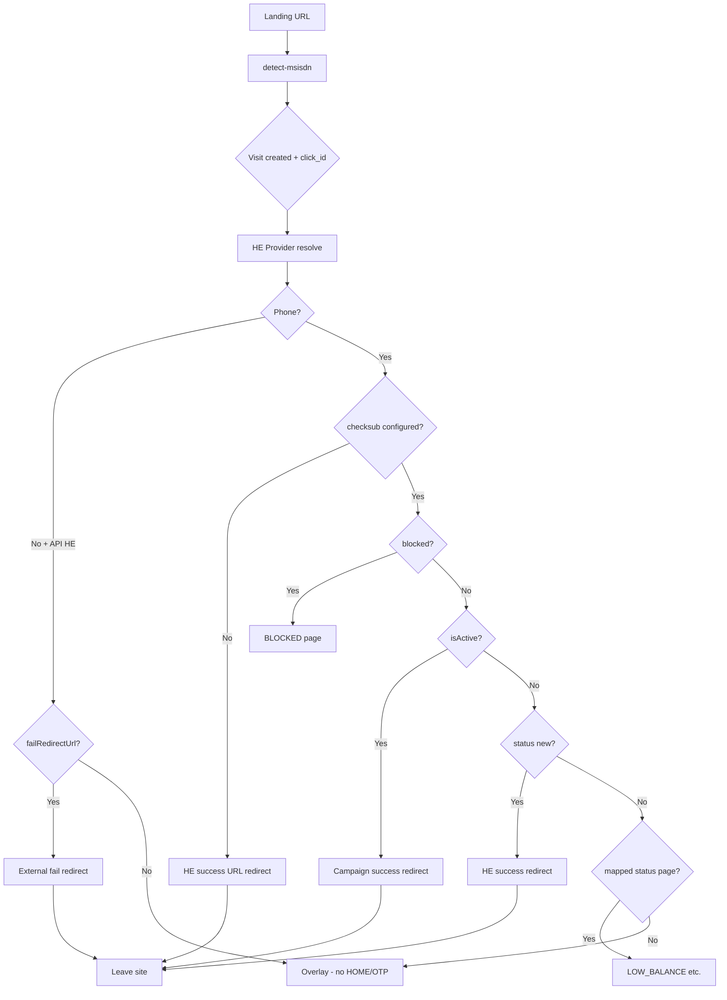

# Header Enrichment (HE) Detect Flow — Architecture

> **Purpose:** Landing page pe user ka mobile number detect karna, subscription status check karna, aur sahi jagah redirect karna — bina internal HOME/OTP flash kiye (API HE campaigns ke liye).

**Last updated:** Aug 2026  
**Primary files (reference only):**
- Backend: `backend/src/modules/flow/flow.service.js` → `detectMsisdn()`
- Backend: `backend/src/modules/flow/partner-api.service.js` → checksub / blocklist
- Frontend: `frontend/src/services/flow/resolvePhoneNumber.js`
- Frontend: `frontend/src/pages/SubscriptionPage.jsx`

---

## 1. High-level picture

User affiliate link se aata hai → subscription page load hoti hai → **detect** chalta hai → decision → **bahar redirect** ya **internal status page** (LOW_BALANCE, BLOCKED, etc.).

```
Affiliate URL
     │
     ▼
┌─────────────────────────────────────────────────────────┐
│  SubscriptionPage (frontend)                             │
│  ┌──────────────┐    parallel (sequenced for API HE)   │
│  │ HE Detect    │───► GET /api/flow/detect-msisdn       │
│  └──────────────┘                                       │
│  ┌──────────────┐    blocked until detect for API HE    │
│  │ Page Boot    │───► GET /api/flow/page (HOME etc.)    │
│  └──────────────┘    HOME/OTP suppressed in HE-only    │
└─────────────────────────────────────────────────────────┘
     │
     ▼
Decision: external redirect | internal status page | overlay (no funnel)
```

**Do alag cheezein:**
1. **Detect** — phone + routing decision (backend heavy)
2. **Boot** — funnel pages load karna (frontend); API HE pe HOME/OTP ab band hai

---

## 2. HE provider types

| Type | Examples | Phone source |
|------|----------|--------------|
| **Header HE** | Operator injects MSISDN in HTTP headers | Header / query hint / dev dummy |
| **API HE (Token HE)** | `safaricom_masked`, `custom_http`, `custom` | Sirf partner API response — query `msisdn` ignore |

API HE = Safaricom jaisa flow: pehle token, phir masked MSISDN API. Desktop/WiFi pe phone nahi milta → **fail redirect**.

---

## 3. Backend: `detectMsisdn` pipeline

### Step 0 — Campaign resolve
URL se `country`, `operator`, `campid`, `tracking_campid` → DB me campaign + `api_config` (HE URLs, checksub, blocklist).

### Step 1 — Visit-first (attribution)
**Pehle visit + click_id banate hain**, phir koi bhi HE/partner HTTP call.

- Affiliate ka `rcid` preserve hota hai
- Hamara `click_id` mint hota hai
- Saari logs (HE token, checksub, HE_REDIRECT) **same visitId** pe attach

Duplicate detect avoid:
- Redis cache key: `flow:detect:result:{visitId}` (60s, jab cache on ho)

### Step 2 — HE resolve (`heService.resolve`)
Campaign ke `he_config_json` se:
- Token URL call (Safaricom)
- MSISDN API call
- Returns: `phone`, `provider`, `error`, `successRedirectUrl`, `failRedirectUrl`

**API HE rule:** `rawPhone` sirf HE API se — URL/header fallback **nahi**.

### Step 3 — Checksub + Blocklist (conditional)
Sirf jab **phone mila** aur APIs configured:

| API | Kab chalti hai |
|-----|----------------|
| `subscriptionApi` (checksub) | `hasChecksub` |
| `blocklistApi` | `hasBlocklist` |

Dono parallel (`Promise.all`).  
`/flow/page` pe dubara checksub skip hota hai agar visit pe pehle se checksub log hai.

**Status mapping (partner-api):**
- `serviceNotExists` / empty serviceId → status **`new`** (pehle `unknown` tha jo HOME dikha deta tha)

### Step 4 — Redirect URL build
Variables inject: `{{msisdn}}`, `{{click_id}}`, `{{rcid}}`, campid, etc.

| URL | Source |
|-----|--------|
| **HE success** | `he_config.successRedirectUrl` |
| **Campaign success** | `campaign.successRedirectUrl` (active users) |
| **Fail / CG** | `he_config.failRedirectUrl` → fallback `campaign.cgRedirectUrl` (API HE only) |

**No phone rule:** `successRedirectUrl` hamesha clear — success URL bina phone ke leak nahi hota.

### Step 5 — Routing decision matrix

Phone **nahi** + API HE + fail URL set:
```
→ outboundFailRedirectUrl = fail URL
→ redirectOutcome = "fail"
```

Phone **mila** + checksub configured:

| Condition | Outcome |
|-----------|---------|
| Blocklist hit | `nextPage = BLOCKED` |
| `isActive` | Campaign **successRedirectUrl** (ya `THANKYOU` agar URL nahi) |
| status = **`new`** | HE **successRedirectUrl** |
| parking / grace / etc. | `nextPage` = LOW_BALANCE, etc. |
| inconclusive | URLs clear, stay |

Phone **mila** + checksub **nahi**:
```
→ Legacy: HE successRedirectUrl
```

### Step 6 — Session logging
`ApiCallType.HE_REDIRECT` log — Session Detail me dikhta hai:
- outcome: `fail`, `he_success`, `campaign_success`, `blocked`, `stay`, etc.
- heProvider, heError, subscriptionStatus, nextPage

### API response (frontend ko)
```
phone, hasMsisdn, heProvider, heError,
failRedirectUrl, successRedirectUrl, cgRedirectUrl,
nextPage, blocked, subscriptionStatus, isActive,
visitId, clickId, rcid
```

---

## 4. Frontend: phone resolution

**File:** `resolvePhoneNumber.js`

Priority order:
1. URL me `msisdn` (testing) — phir bhi detect call hoti hai (redirect URLs ke liye)
2. Custom hook `window.__templatecraft_resolvePhone`
3. Operator detect (`detectMsisdnApi`)
4. Storage / window — **API HE fail pe skip** (stale phone se HOME nahi dikhe)

**API HE + empty phone:** storage fallback band — sirf detect ka result + redirect fields return.

---

## 5. Frontend: SubscriptionPage lifecycle

### 5.1 Landing pe do kaam

```
┌─────────────────┐     ┌─────────────────┐
│ Detect effect   │     │ Boot effect     │
│ resolvePhone    │     │ loadPage(HOME)  │
└────────┬────────┘     └────────┬────────┘
         │                       │
         │   API HE: boot WAITS  │
         │   until detect done   │
         └───────────┬───────────┘
                     ▼
              Decision applied
```

**Pehle (bug):** Boot turant HOME load karta tha → Safaricom fail pe bhi HOME flash.  
**Ab:** Fresh landing pe boot `waitForHeDetect()` (max ~12s) karta hai.

### 5.2 Detect complete hone ke baad (frontend routing)

```
Detect result
     │
     ├─ phone empty + failRedirectUrl ──► window.location.replace(fail URL)
     │
     ├─ phone + successRedirectUrl ─────► success redirect (overlay "Redirecting…")
     │
     ├─ phone + nextPage (BLOCKED, LOW_BALANCE…) ► loadPage(nextPage) — allowed
     │
     └─ API HE + kuch nahi ─────────────► overlay rehta hai (HOME/OTP nahi)
```

**Fail redirect pehle** — session phone / HOME boot se pehle.

**Attribution:** `appendHeAttributionToUrl` — `click_id`, `rcid`, `msisdn` query me append.

### 5.3 HE-only mode (HOME + OTP suppressed)

Jab detect `heProvider` = `safaricom_masked` | `custom_http` | `custom`:

| Action | Behavior |
|--------|----------|
| `loadPage('HOME')` | Blocked |
| `loadPage('OTP')` | Blocked |
| Boot entry HOME | Skip |
| Saved session resume HOME/OTP | Skip after detect |
| URL `?step=HOME` | Ignore |
| Backend returns OTP page | `cachePage` reject — render nahi |

**Allowed internal pages:** LOW_BALANCE, BLOCKED, THANKYOU, CONFIRM, INPROGRESS, ERROR.

UI: spinner — "Detecting mobile number…" → "Redirecting…"

### 5.4 Overlay / visibility

```
hideHomeForHe =
  phoneResolving
  OR heExitPending (redirect chal raha)
  OR heFunnelSuppressed + (no page OR page is HOME/OTP)
```

Funnel HTML `visibility: hidden` jab tak redirect na ho.

---

## 6. End-to-end scenarios

### A — Desktop dev, Safaricom API HE (BurkinaFaso / Orange)
1. No mobile data → HE API error: "Please use Safaricom Mobile Data"
2. `phone = ''`, `failRedirectUrl = https://www.pw.live/...`
3. Frontend fail redirect → **pw.live** (HOME kabhi nahi dikhta)

### B — Mobile data, new subscriber
1. HE se phone milta hai
2. checksub → status `new`
3. Redirect → **HE successRedirectUrl** (campaign HOME nahi)

### C — Mobile data, already active
1. HE se phone
2. checksub → `isActive = true`
3. Redirect → **campaign successRedirectUrl**

### D — Mobile data, low balance
1. HE se phone
2. checksub → parking/grace
3. `nextPage = LOW_BALANCE` → internal page (HOME/OTP nahi)

### E — Blocked MSISDN
1. checksub OK, blocklist hit
2. `nextPage = BLOCKED`

### F — Header HE (non-API)
- Query/header/dummy se phone
- Purana funnel: HOME/OTP allowed
- HE-only suppression **nahi** lagta

---

## 7. Duplicate call prevention

| Layer | Mechanism |
|-------|-----------|
| Backend | Redis detect result cache per visitId (60s) |
| Backend | `/flow/page` skip checksub if already logged |
| Frontend | `detectInFlightRef` — ek concurrent detect |
| Frontend | `heDetectSettledRef` — boot wait |
| API client | In-flight dedupe same detect URL |

---

## 8. Session Detail — kya dikhega

Ek visit pe chain:
1. **VISIT** — landing create
2. **HE token / MSISDN API** calls (Safaricom)
3. **checksub** (agar phone + API configured)
4. **blocklist** (agar configured)
5. **HE_REDIRECT** — final decision + URL

Missing logs = usually visit create se pehle API call (ab fix: visit-first).

---

## 9. Config checklist (campaign admin)

| Field | Role |
|-------|------|
| `he_provider` | `safaricom_masked` etc. |
| `he_config_json` | token URL, MSISDN URL, success/fail URLs |
| `subscription_api` | checksub endpoint |
| `service_id` | checksub ke liye zaroori (blank = `new`) |
| `blocklist_api` | optional |
| `success_redirect_url` | active users ke liye |
| `cg_redirect_url` | fail fallback |

---

## 10. Known dev gotchas

| Issue | Cause | Fix |
|-------|-------|-----|
| HOME flash | Boot parallel tha | Boot waits + HE-only suppress |
| Stuck spinner | Strict Mode cancelled detect | Redirect without cancelled guard; inFlight reset |
| Wrong redirect (HOME) | status `unknown` | `serviceNotExists` → `new` |
| Dummy phone local | `HE_DUMMY_MSISDN` in `.env` | API HE path dummy use nahi karta; header HE karta hai |
| Backend start fail | `npm run dev` missing | Use `npm run start:dev` or `./dev.sh` |

---

## 11. Future / toggles

- **HE-only mode** ab hardcoded API HE providers pe — baad me feature flag se OTP wapas la sakte ho
- **E2E script:** `backend/scripts/e2e-detect-flow.mjs` (curl-based backend tests)
- Non-API HE campaigns pe purana HOME → OTP funnel ab bhi kaam karta hai

---

## 12. One-page decision flow (mermaid)



---

*Yeh document code ki jagah architecture explain karta hai. Implementation detail ke liye upar wale files dekho.*
