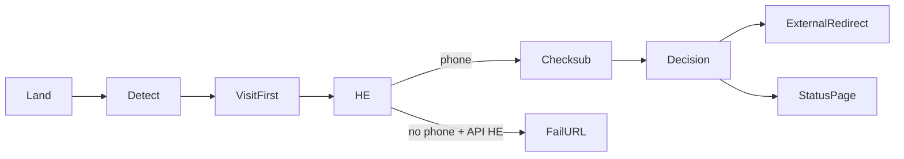

# Header Enrichment (HE) Detect Flow

> **Superseded.** Full canonical reference (AI-ready):
> **[`docs/FLOW-ARCHITECTURE.md`](./FLOW-ARCHITECTURE.md)**
>
> Use that file for detect pipeline, attribution, redirects, postbacks, API map, and invariants.
> This stub exists so old links still resolve.

**Quick HE facts (current code):**

| Topic | Rule |
|-------|------|
| API HE providers | `safaricom_masked`, `custom_http`, `custom` |
| Phone for API HE | Partner API only — ignore query/header/dummy for routing |
| Fail / success redirect | Open configured URL **as-is** — **no** `click_id` / `campid` / `rcid` append |
| HOME/OTP on API HE | Suppressed until redirect or allowed status page |
| Visit-first | Mint visit + `click_id` before any HE HTTP |
| Setup guide | [`SAFARICOM_HE_SETUP_GUIDE.md`](./SAFARICOM_HE_SETUP_GUIDE.md) |

*Last updated: Aug 2026*
